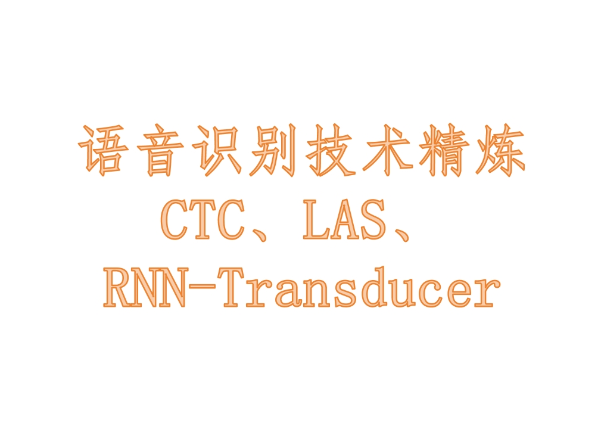
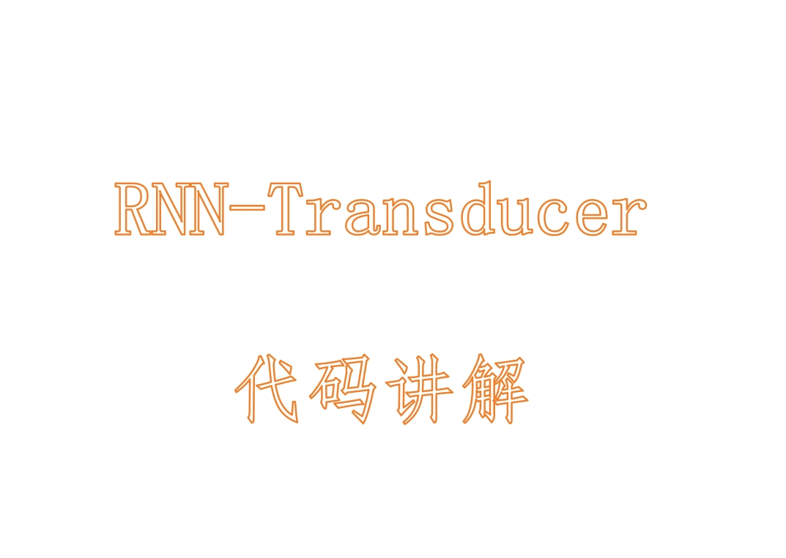
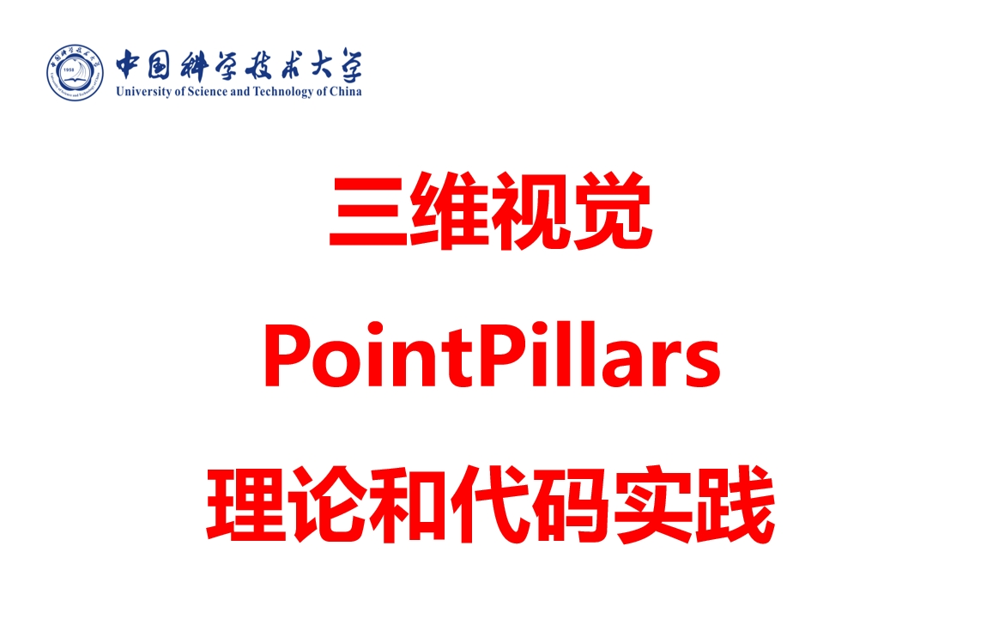

# AI-Practices
分享各行业实用的AI技术实践，涵盖视觉、语音、音频、点云、多模态等方面。

如果对你有帮助，请帮忙Star哈。

持续更新中。

## 1. AI工程系列

| 标题 | 封面 | 视频（播放数） |
| -- | -- |:--:|
| 彻底搞懂深度学习环境配置 | |     |

## 2. 视觉技术
| 标题 | 封面 | 视频（播放数） |
| -- | -- |:--:|
| 目标检测SOTA算法Co-DETR| |     |

## 3. 语音技术
| 标题 | 封面 | 视频（播放数） |
| -- | -- |:--:|
| 语音识别技术精炼 CTC、LAS、RNN Transducer | |     |
| RNN-Transducer代码讲解 | |     |

## 4. 三维技术
| 标题 | 封面 | 视频（播放数） |
| -- | -- |:--:|
| 三维点云PointPillars| |     |
| 三维视觉技术深入浅出| |     |
| 单视几何| |     |
| 三维重建| |     |
| 双面立体视觉| |     |
| 多视图几何-上| |     |
| 多视图几何-下| |     |
| 运动恢复结构SFM| |     |
| SLAM系统-上| |     |
| SLAM系统-下| |     |
| 摄像机标定| |     |

## 5. 多模态技术

## 6. AIGC

## 7. 数据集

